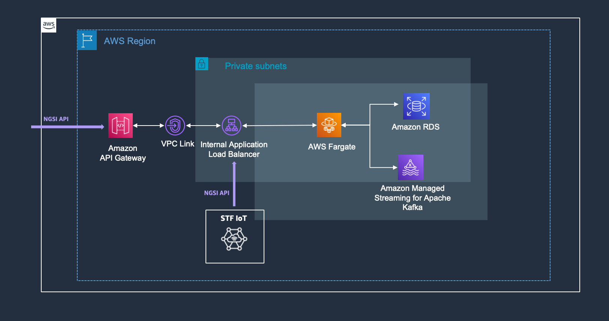
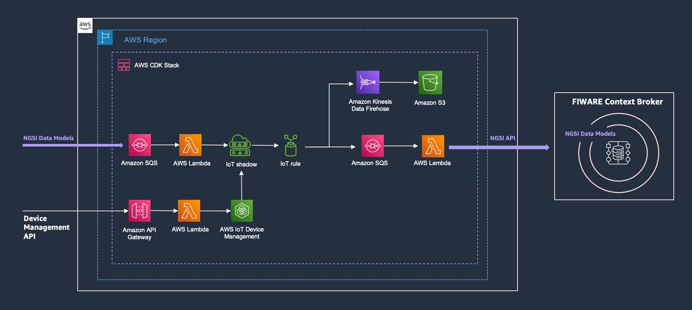
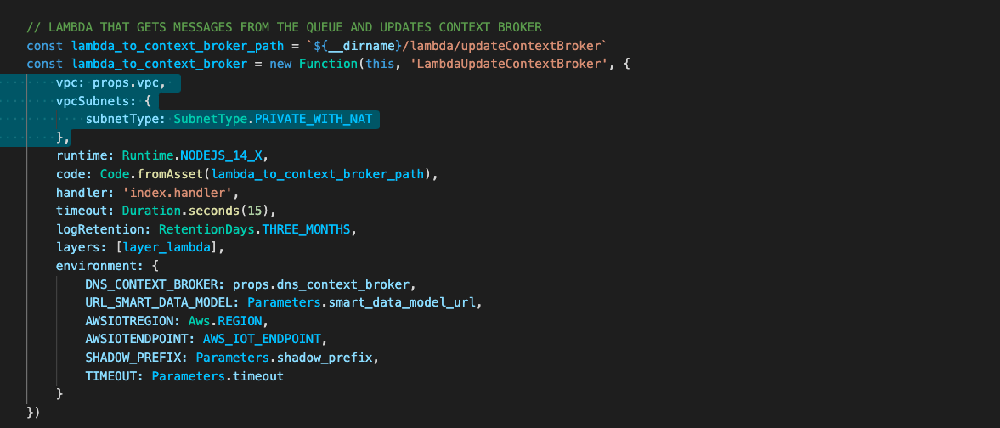
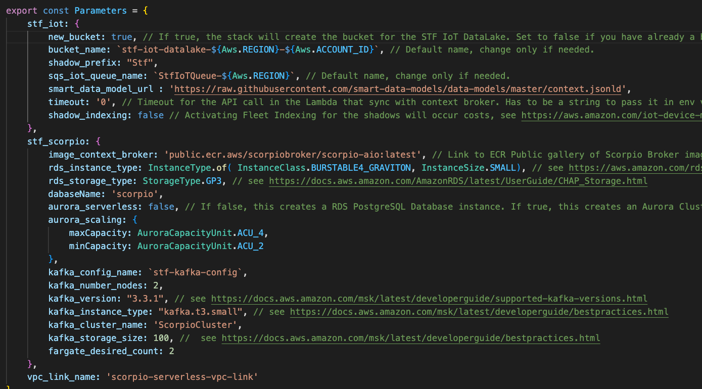
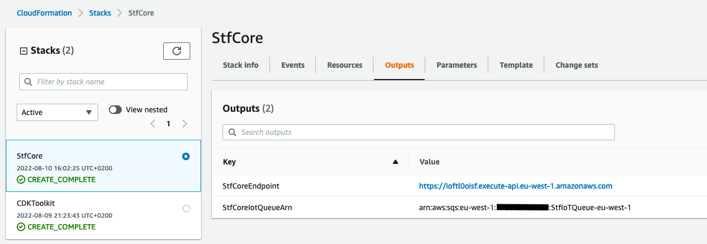
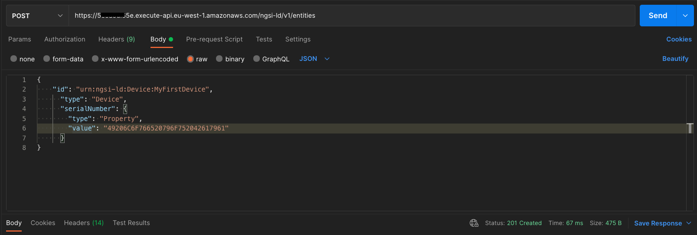
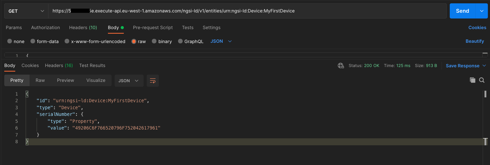
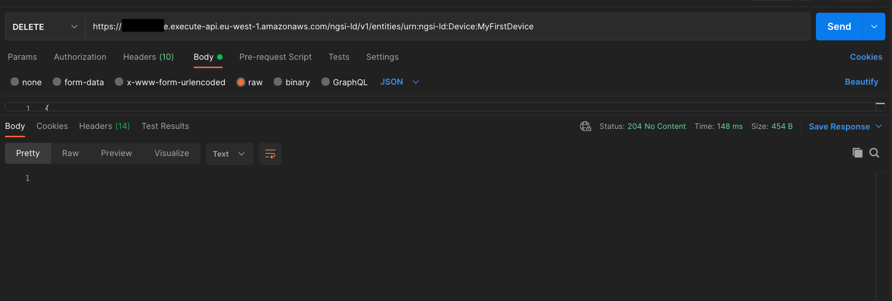
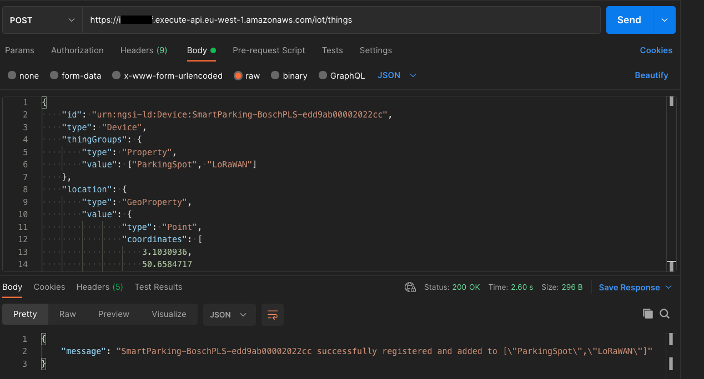

# Smart Territory Framework Core - STF Core 

<br>

> :warning: **This stack is for demonstration purposes only. The nested stack deploying the NEC Scorpio Broker exposes an API endpoint to the public for testing the Context Broker. Before using in production, please consider adding a [mechanism for controlling and managing access](https://docs.aws.amazon.com/apigateway/latest/developerguide/http-api-access-control.html) to this API.** 

<br> 

## Overview 

The Smart Territory Framework - STF - is a set of tools and standardized modules that our partners and customers can assemble together to build and operate sustainable and highly effective solutions. 

The STF complies with [NGSI-LD](https://www.etsi.org/technologies/internet-of-things) standard and leverages the NGSI-LD compliant [Smart Data Models](https://smartdatamodels.org/) initiative that provides open-licensed data models for different [domains](https://github.com/smart-data-models/data-models/tree/master/specs) such as Smart Cities, Smart Agrifood, Smart Environment, Smart Sensoring, Smart Energy, Smart Water, Smart Destination, Smart Robotics and Smart Manufacturing.

Modular and built on open source and standards, the STF makes it easy to integrate existing solutions and add new capabilities and modules over time to its **core**. The core of the STF - STF Core - consists of two modules: the STF IoT module and the open-source FIWARE Context Broker.

This repository contains an [AWS CDK](https://aws.amazon.com/cdk) application that enables you to deploy the STF Core stack. The STF Core stack consists of two nested stacks: 
- a stack to deploy the NEC Scorpio Context Broker (using [Serverless services on AWS](https://aws.amazon.com/serverless/?nc1=h_ls)),
- a stack to deploy the STF IoT module.

<br>

## Prerequisites
<br>

To deploy the STF Core stack, you need the following:
- An AWS account. If you don't have one, see [Set up an AWS account](https://aws.amazon.com/premiumsupport/knowledge-center/create-and-activate-aws-account/).
- An AWS Identity and Access Management (IAM) user with administrator permissions
- AWS CDK Toolkit installed. See [Getting started with the AWS CDK](https://docs.aws.amazon.com/cdk/latest/guide/getting_started.html) to install it.
- Understand the NGSI-LD standard and the FIWARE Context Broker. This [blog post](https://rihab-feki.medium.com/all-you-need-to-know-to-create-your-own-ngsi-ld-data-model-e234b7ca3d22) gives a good overview of both topics. 


<br>

## Table of Contents

- [The FIWARE Context Broker](#the-fiware-context-broker)
- [STF IoT](#stf-iot)
- [Getting started](#getting-started)
- [How to use it](#how-to-use-it)
- [Building Data Producers and Data Consumers](#building-data-producers-and-data-consumers)
- [Design Considerations](#design-considerations)
- [Additional Resources](#additional-resources)
- [Troubleshooting](#troubleshooting)

<br>

## The FIWARE Context Broker 

The Context broker is an open source component that enables the connection and integration of different systems, applications and services within an organization. 

Using the Context Broker territories can assemble and store information from different systems, eventually belonging to different organisations, instead of having them perform in separate silos. 

It provides geo-located queries capabilities as well as a subscription mechanism enabling an independent module like a mobile application to query data filtered by geographical location but also to be notified with a given frequency or when changes on data take place (e.g., an air quality measurement is above a specified threshold value).

Among the [multiple implementations](https://www.fiware.org/developers/catalogue/) of the FIWARE Context Broker available, we have selected the NEC Scorpio Broker 2.0 for this CDK application. The NEC Scorpio Broker 2.0 fully complies with the NGSI-LD specification (ETSI NGSI-LD 1.3.1). 

The STF Core leverages [Serverless services on AWS](https://aws.amazon.com/serverless/?nc1=h_ls) for automatic scaling, built-in high availability, and a pay-for-use billing model to increase agility and optimize costs. 

[NEC Laboratories Europe](https://www.neclab.eu/) and AWS have worked together to provide a scalable and available implementation of the NEC Scorpio Broker 2.0 on AWS using:

- [AWS Fargate](https://aws.amazon.com/fargate/?nc1=h_ls) to easily run and scale the [NEC Scorpio Broker container](https://gallery.ecr.aws/j9u9o5d1/). 
- [Amazon Aurora Serverless](https://aws.amazon.com/rds/aurora/serverless/?nc1=h_ls) to automatically start up, shut down, and scale capacity up or down for the PostgreSQL database used by NEC Scorpio Broker. 
- **[ Coming soon ]** [Amazon MSK Serverless](https://aws.amazon.com/msk/features/msk-serverless/) to make it easy to run the Apache Kafka used by NEC Scorpio Broker without having to manage and scale cluster capacity. **Until Amazon MSK Serverless is still in preview, this stack uses [Amazon MSK](https://aws.amazon.com/msk/)**. 

<br>



<br>

## STF IoT 

Built around the FIWARE Context Broker, the STF IoT module expands its capabilities enabling territories to ingest IoT data at scale from multiple and heterogeneous sources with advanced device management capabilities like for example a registry of all the devices and sensors deployed in the territory, regardless the operating model, the technology and the connectivity used.

The STF IoT module offers [Digital Twin](https://www.digitaltwinconsortium.org/initiatives/the-definition-of-a-digital-twin.htm) capabilities enabling territories to store and retrieve in real-time the current state of every registered device. 

It also consists of an IoT data lake built on [Amazon S3](https://aws.amazon.com/s3/?nc1=h_ls) that territories can use to store, query and generate insights about their IoT data but also to easily visualise them.

<br>



<br>

The STF IoT module provides a [central registry](https://docs.aws.amazon.com/iot/latest/developerguide/iot-thing-management.html) to store all your devices following the Smart Data Model [```Device```](https://github.com/smart-data-models/dataModel.Device/blob/master/Device/README.md). 

All measurements and data produced by a device are linked to the registered device and stored in its [Device Shadows](https://docs.aws.amazon.com/iot/latest/developerguide/iot-device-shadows.html) following the relevant data model like for example [```AirQualityObserved```](https://github.com/smart-data-models/dataModel.Environment/blob/master/AirQualityObserved/README.md) for air quality measurements. 

This gives an exhaustive view in real-time of the state of the device and its measurements providing Digital Twin capabilities. The STF IoT module is synchronized in real-time with the Context Broker so any change that occurs in the STF IoT module is replicated in the Context Broker and stored as well in the STF IoT Data Lake.

The STF IoT Data Lake is built on top of Amazon S3. A bucket named ```stf-iot-datalake-${Aws.REGION}-${Aws.ACCOUNT_ID}``` is created when this stack is deployed. You can use an existing bucket by modifying the STF IoT Data Lake construct ([Link](./lib/stacks/stf-iot/stf-iot-datalake/index.ts) to the file).

<br>


<br>

The STF IoT module also consists of an API for device management. the STF IoT Device API enables you to provision your things in the STF registry. *Only the action of creating a thing is developed in this stack. You can check the [code](./lib/stacks/stf-iot/stf-iot-api/index.ts) to expand its capabilities adding others actions like ```delete``` and ```update``` a thing*.

<br>

> :warning: Before using in production, please consider adding a [mechanism for controlling and managing access](https://docs.aws.amazon.com/apigateway/latest/developerguide/apigateway-control-access-to-api.html) to the STF IoT Device API in addition to the API key mechanism provided in this stack.

<br>

Note also that in this CDK application, the STF IoT stack is designed to directly request the Context Broker running in private subnets via an internal (non-internet-facing) load balancer. 
Accordingly, the [Lambda function](./lib/stacks/stf-iot/stf-iot-core/lambda/updateContextBroker/index.js) that interacts with the Context Broker is [in a VPC](https://docs.aws.amazon.com/lambda/latest/dg/configuration-vpc.html). 

<br>



<br>

In case you want to deploy the STF IoT stack independently and connect it to an existing Context Broker, you can update the [configuration](./lib/stacks/stf-iot/stf-iot-core/index.ts) and the [code](./lib/stacks/stf-iot/stf-iot-core/lambda/updateContextBroker/index.js) of the Lambda function to adapt to the security requirements of your existing Context Broker. 


## Getting started 

> :warning: Deploying the application contained in this repository will cause your AWS Account to be billed for any AWS services used by the application

<br> 

This repository contains an AWS CDK application that enables you to deploy and provision the STF Core stack code and its supporting infrastructure. AWS CDK provisions your resources in a safe, repeatable manner through AWS CloudFormation. 

The application includes a file [```parameters.ts```](./parameters.ts) in which some configuration parameters are set (Scorpio Broker container image URL, key for the IoT Device Management API, ...). 

<br>



<br> 

Once the configuration parameters checked, you can deploy the application using the following commands: 

<br>

```
npm install
```

```
cdk bootstrap
```

```
cdk deploy
```

<br>

> The deployment of the STF Core stack can take up to an hour. 

<br>

Once the STF Core stack is deployed, you will find in the output all the information needed to operate and connect your smart solutions using the STF including: 

- The public API endpoint ```ContextBrokerPublicApiEndpoint``` for the Scorpio Broker. This API fully complies with the [NGSI-LD API](https://forge.etsi.org/swagger/ui/?url=https://forge.etsi.org/rep/NGSI-LD/NGSI-LD/raw/master/spec/updated/generated/full_api.json). Before using this stack in production, please consider adding a [mechanism for controlling and managing access](https://docs.aws.amazon.com/apigateway/latest/developerguide/http-api-access-control.html) to this [HTTP API](https://docs.aws.amazon.com/apigateway/latest/developerguide/http-api.html).

- The STF IoT Device API endpoint ```IotDeviceApiEndpoint``` for the IoT Device Management. You will use this endpoint (using the API key defined in the file [```parameters.ts```](./parameters.ts)) to provision your things in the STF registry. Before using this stack in production, please consider adding a [mechanism for controlling and managing access](https://docs.aws.amazon.com/apigateway/latest/developerguide/apigateway-control-access-to-api.html) to this [REST API](https://docs.aws.amazon.com/apigateway/latest/developerguide/apigateway-rest-api.html). 

- The ARN of the Amazon SQS Queue of the STF IoT module ```IotSqsArn```. The default value of the ARN of this queue is `arn:aws:sqs:${Aws.REGION}:${Aws.ACCOUNT_ID}:StfIoTQueue-${Aws.REGION}`. 
This queue is the single entry point for all data producers. Usually, the data producer transforms the source data format into the data model relevant to the use case and then publishes the transformed data into the queue. See [Building Data Producers and Data Consumers ](#building-data-producers-and-data-consumers) section for more details. 

<br>


<br>

<br>

> See [How to use it](#how-to-use-it) section for more details. 

<br>

You can also find this information in the [AWS CloudFormation console](https://console.aws.amazon.com/cloudformation/) in the **Outputs** tab after selecting the STF Core Stack. 

<br>



<br> 

## How to use it

<br>

Now that the STF Core is up and running you can innovate at a fast pace. You can easily add new modules and capabilities, new data producers and consumers over time. you can integrate your existing applications and legacy systems.

### Checking that the Context Broker is running

Before this, let's check that the FIWARE Context Broker is up and running. You can send an HTTP GET to ```{ContextBrokerPublicApiEndpoint}```/actuator/info. In the example below, I use the [CURL](https://curl.se/) tool in my terminal but you can paste the URL into any web browser. 

```
curl https://abced5678.execute-api.aws-region.amazonaws.com/actuator/info
```

The response is: 

```json
{ 
    "build":
        {
            "artifact": "AllInOneRunner",
            "name":"AllInOneRunner",
            "time":"2022-03-04T09:59:37.981Z",
            "version":"1.1.0-SNAPSHOT",
            "group":"eu.neclab.ngsildbroker"
        }
}
```

__Voilà!__ 

### Understanding the NGSI-LD Information Model

Before you build solutions and start ingesting data using the STF Core, you need to understand the NGSI-LD Information model and the [design considerations](#design-considerations) for builing a Smart Territory Platform using the STF.  

<br>

> See [Design Considerations](#design-considerations) for more information.

<br> 

The NGSI-LD specification provides an [open API](https://forge.etsi.org/swagger/ui/?url=https://forge.etsi.org/rep/NGSI-LD/NGSI-LD/raw/master/spec/updated/generated/full_api.json) for managing and requesting information and an underlying information model based on **Entities** that are digital representations of real-world objects having Properties and Relationships with other entities. 

**Every information stored in the Context Broker and in the STF IoT module is an NGSI-LD entity.**

<br>


<br> 

Since NGSI-LD is based on [JSON-LD](https://json-ld.org/), Entities are stored with their [context](https://w3c.github.io/json-ld-syntax/#the-context)


Below an extract of the definition of the [context](https://w3c.github.io/json-ld-syntax/#the-context) from the JSON-LD specification: 

_When two people communicate with one another, the conversation takes place in a shared environment, typically called "the context of the conversation". This shared context allows the individuals to use shortcut terms, like the first name of a mutual friend, to communicate more quickly but without losing accuracy. A context in JSON-LD works in the same way. It allows two applications to use shortcut terms to communicate with one another more efficiently, but without losing accuracy. Simply speaking, a [context](https://w3c.github.io/json-ld-syntax/#dfn-context) is used to map [terms](https://w3c.github.io/json-ld-syntax/#dfn-term) to [IRIs](https://www.rfc-editor.org/rfc/rfc3987#section-2)._

A context is basically a list of key-values defining aliases (shortcut terms) for longer terms (IRIs).

```json
{
    "@context": {
        "temperature": "https://smart-data-models.github.io/data-models/terms.jsonld#/definitions/temperature", 
        "co2": "https://smart-data-models.github.io/data-models/terms.jsonld#/definitions/co2"
    }
}
```

Alongside the built-in [NGSI-LD default context](https://uri.etsi.org/ngsi-ld/v1/ngsi-ld-core-context.jsonld), the STF leverages the Smart Data Models and its [context](https://raw.githubusercontent.com/smart-data-models/data-models/master/context.jsonld). The URL of the Smart Data Models context is provided in the file [```parameters.ts```](./parameters.ts). 

Before creating or updating an entity in the Context Broker, the STF IoT will provide this context in the request so the Context Broker can store the corresponding expanded form of the entity. 

For example, below an entity of type `Device` in its compacted form using the Smart Data Models context. 

```json
{
    "id": "urn:ngsi-ld:Device:MyFirstDevice",
      "type": "Device",
      "serialNumber": {
        "type": "Property",
        "value": "49206C6F766520796F752042617961"
      },
      "@context": "https://raw.githubusercontent.com/smart-data-models/data-models/master/context.jsonld"
}
```

The Context Broker will store it in its expanded form (using the context provided) as below: 

```json
{
    "id": "urn:ngsi-ld:Device:MyFirstDevice",
    "type": "https://uri.fiware.org/ns/data-models#Device",
    "https://smart-data-models.github.io/data-models/terms.jsonld#/definitions/serialNumber": {
        "type": "Property",
        "value": "49206C6F766520796F752042617961"
    }
}
```

To get the entity in its compacted form, the `GET` request sent to the Context Broker must include the Smart Data Models context or any context defining the compacted term for each property. 

If you need to change compacted terms for translation purposes for example, when requesting the Context Broker, you can provide a custom context defining the terms you want. See the example below for a context that maps the IRI of the initial property `serialNumber` to a new term `NumeroSerie`.

```json
{
    "@context": {
        "NumeroSerie": "https://smart-data-models.github.io/data-models/terms.jsonld#/definitions/serialNumber"
    }
}
```

That being said, you are ready to create your first entity.


### Create your first entity in the Context Broker

In this section, you will use the tool [Postman](https://www.postman.com/product/what-is-postman/) to test the Context Broker API. 

You will use the Context Broker public API endpoint to create your first entity. 

For CRUD (Create, Read, Update and Delete) operations on entities, the endpoint `{ContextBrokerPublicApiEndpoint}/ngsi-ld/v1/entities` is used. 

When using the `POST` method, you can provide the `@context` in the payload, as shown above, or in the HTTP headers:  
```
Link: <https://raw.githubusercontent.com/smart-data-models/data-models/master/context.jsonld>; rel="http://www.w3.org/ns/json-ld#context"; type="application/ld+json"
``` 

For the `GET` method, you can only use the HTTP headers to pass the context. In this section, you will use the HTTP headers to provide the context. 

In Postman, select the `POST` method. Enter the `{ContextBrokerPublicApiEndpoint}/ngsi-ld/v1/entities` endpoint.

In the tab **Headers**, provide the context as shown below:

<br>


<br>

In the tab **Body**, select **raw**. Then, in the drop-down menu, select **JSON** (instead of **Text**). Finally enter the payload below: 

```json
{
    "id": "urn:ngsi-ld:Device:MyFirstDevice",
      "type": "Device",
      "serialNumber": {
        "type": "Property",
        "value": "49206C6F766520796F752042617961"
      }
}
```

_As you can see, here you don't need to provide the `@context` as it is provided in the headers._

Then choose **Send** to create your first entity. The response code should be `201` if the operation succeeds. 

<br>



<br>

You can check that the entity is stored by sending a `GET` request to the endpoint `{ContextBrokerPublicApiEndpoint}/ngsi-ld/v1/entities/urn:ngsi-ld:Device:MyFirstDevice`

<br>



<br>

_If you still provide the context in the header, the entity will be compacted._


You can now delete this entity by sending a `DELETE`request to the endpoint `{ContextBrokerPublicApiEndpoint}/ngsi-ld/v1/entities/urn:ngsi-ld:Device:MyFirstDevice`

<br>



<br>


Now, you can start provision your devices and ingesting data using the STF IoT Device API. 

### Register your first thing using the STF IoT Device API

Implementing smart and efficient solutions using the STF requires some design considerations. While some of them will be discussed in this section, a whole section is dedicated to these [design considerations](#design-considerations). 

In this section, you will use the IoT API to register a thing in the central IoT registry and then check that its entity of type `Device` is stored in its shadow named `Stf-Device` and in the Context Broker. 

You use the tool [Postman](https://www.postman.com/product/what-is-postman/) to send a `POST` request to the `{IotDeviceApiEndpoint}/devices` endpoint with the following body:

```json
{
    "id": "urn:ngsi-ld:Device:SmartParking-BoschPLS-edd9ab00002022cc",
    "type": "Device",
    "thingGroups": {
        "type": "Property",
        "value": ["ParkingSpot", "LoRaWAN"]
    },
    "location": {
        "type": "Property",
        "value": {
                "type": "Point",
                "coordinates": [
                    3.1030936,
                    50.6584717
                ]
        }
    }
}
```

<br>

:warning: Do not forget to provide the API key, set in the file [```parameters.ts```](./parameters.ts), in the header `x-api-key`.

<br>



<br>


This will create a thing named `SmartParking-BoschPLS-edd9ab00002022cc` in [AWS IoT Core Things Registry](https://docs.aws.amazon.com/iot/latest/developerguide/thing-registry.html) and create or update its shadow named `Stf-Device` with the payload above. 

<br>

> See [Design consideration](#design-considerations) section to learn more about the naming conventions for things in the registry. 

<br>


<br>

The property `thingGroups` __is not part of the data model__ and is removed before updating the Device Shadow. You can use this property to add your thing in up to 10 [Thing Groups](https://docs.aws.amazon.com/iot/latest/developerguide/thing-groups.html). In the example above, the thing is added to the groups `ParkingSpot` and `LoRaWAN`. 

<br>

You can check that this entity has been created in the Context Broker as well by sending a `GET` request to `{ContextBrokerPublicApiEndpoint}/ngsi-ld/v1/entities/urn:ngsi-ld:Device:SmartParking-BoschPLS-edd9ab00002022cc`

If it's all good, you are ready to start building your data producers and data consumers.  

## Building Data Producers and Data Consumers 

When using the STF, Data Producers are decoupled from Data Consumers. You can build each of both independently as the information model is standardized and known in advance. 

You can for example build a [Grafana dashboard](https://docs.aws.amazon.com/grafana/latest/userguide/what-is-Amazon-Managed-Service-Grafana.html) to visualise your data [using Amazon Athena](https://aws.amazon.com/athena/) to query your IoT Data Lake. 

You can build your Data Producers within hours as the only process needed to integrate a new source of data, is to transform the source data format into the data model relevant to the use case before sending the data to the STF IoT module. 

Below a reference architecture with examples of Data Producers and Data Consumers. 

<br>


<br>

For each Data Producer, it is about using the right tool to ingest the data and route it to a [Lambda function](https://docs.aws.amazon.com/lambda/latest/dg/welcome.html) that will transform the source data format into an NGSI-LD entity and then publish it into the STF IoT Queue. 

For example, the steps to build a Data Producer that ingests data from LoRaWAN Parking Lot sensors using a private LoRaWAN Network managed by AWS IoT Core for LoRaWAN are: 

-  [Register](#register-your-first-thing-using-the-stf-iot-device-api) your parking lot sensors in the central registry using the STF IoT Device API using the [naming conventions](#naming-conventions).
- [Onboard](https://docs.aws.amazon.com/iot/latest/developerguide/connect-iot-lorawan-onboard-end-devices.html) your parking lot sensors to AWS IoT Core for LoRaWAN.
- Create a Lambda function that will decode the payload and transform it into an NGSI-LD entity and publish it into the STF IoT Queue.
- Assign a LoRaWAN destination to your LoRaWAN Parking lot sensors. The destination will route the messages to an AWS IoT Rule that will route the messages to the Lambda Function. 

Below an example of the code of a Lambda function that decodes and transforms the payload received from AWS IoT Core for LoRaWAN for the Bosch PLS sensor: 

```javascript 

const STF_IOT_SQS_URL = process.env.STF_IOT_SQS_URL
const THING_PREFIX = process.env.THING_PREFIX
const aws = require('aws-sdk')
const sqs = new aws.SQS({})

exports.handler = async (event) => {
    try {
        const { PayloadData, WirelessMetadata: { LoRaWAN : {FPort, DevEui, Timestamp} }} = event
        const bf = Buffer.from(PayloadData, 'base64')
        console.log(`From ${DevEui}: ${bf.toString('hex')}`)
        let entity = {}
        let thingName 
        entity.type = `ParkingSpot`
        entity.id = `urn:ngsi-ld:${entity.type}:${THING_PREFIX}-${DevEui}`
        entity.status = {
            type: "Property",
            observedAt: Timestamp,
            providedBy: {
                type: 'Relationship',
                object: `urn:ngsi-ld:Device:${THING_PREFIX}-${DevEui}`
            }
        }
        switch (FPort) {
            //Uplink message
            case 1:
                entity.status.value = bf.readUInt8(0) == 0 ? "free" : "occupied"
                break
            //Heartbeat message
            case 2:
                entity.status.value = bf.readUInt8(0) == 0 ? "free" : "occupied"
                break
            //Startup message 
            case 3:
                entity.status.value = bf.readUInt8(16) == 0 ? "free" : "occupied"
                break    
            default:
                break
        }

        let send = await sqs.sendMessage({
            QueueUrl: STF_IOT_SQS_URL, 
            MessageBody: JSON.stringify(entity)
        }).promise()

    } catch (e) {
        console.log(e)
    }
}

```

<br>

## Design Considerations

The STF is designed to be flexible and efficient. It uses the following design guidelines to provide advanced device management capabilities and efficient data ingestion using naming conventions.   

### Naming conventions

The STF IoT module provides a central registry in which you can store all your devices and sensors, regardless the operating model, the technology and the connectivity used. For all types of sensors and devices, the first step is to [register a thing](#register-your-first-thing-using-the-stf-iot-device-api) using the STF IoT Device API. 

To link the data produced by a device to its thing in the registry, there are some naming conventions to follow. 

First, we recommend using a prefix containing the application (or the type) and the device or sensor model. This enables easy filtering and searching your index. You will be able for example to create an IoT Rule that only listens to changes of shadows of things which have a name starting with a specific prefix. 

To continue with our Smart Parking example, using the LoRaWAN Parking lot sensor [Bosch PLS](https://www.bosch-connectivity.com/media/product_detail_pls/parking_lot_sensor_pls_datasheet_2020_12_04_en.pdf), the prefix would be `SmartParking-BoschPLS-`. 

Then, what comes after the prefix must be a unique id that enables the link between the incoming messages and the thing. For example, for LoRaWAN devices, we recommend using the DevEUI of the device. So for the example above, the name of these things in the registry would be `SmartParking-BoschPLS-{DevEUI}`.

When receiving messages from these sensors, the Lambda Function in charge of creating the entity of type `ParkingSpot` only needs to add the static prefix `SmartParking-BoschPLS-` to the DevEUI to get the name of the thing that it needs to update the device shadow. 

Depending the connectivity and the operating model, you will need to onboard your device to the service or platform used. 

For example if using AWS IoT Core for LoRaWAN, you will need to [onboard]((https://docs.aws.amazon.com/iot/latest/developerguide/connect-iot-lorawan-onboard-end-devices.html)) your LoRaWAN device to AWS IoT Core for LoRaWAN in addition to the central registry. 

If using AWS IoT Core to connect using MQTT with a X.509 certificate, then you will need to [attach a certificate and a policy](https://docs.aws.amazon.com/iot/latest/developerguide/create-iot-resources.html) to the thing registered in the IoT registry. 

### NGSI-LD entities

NGSI-LD entitites are digital representations of real-world objects having Properties and Relationships with other entities. Each entity is uniquely identified by an `id` which is the URI of the entity and characterized, by reference in the field `type`, to one NGSI-LD Entity Type. 

__These two fields `id` and `type` are mandatory.__

Using the STF, the `id` of an entity must follow this pattern `urn:ngsi-ld:{Type}:{thingName}` in which `{Type}` is the type of the entity and `{thingName}` is the name of the thing registered in the STF IoT central registry (using the [AWS IoT Core Things registry](https://docs.aws.amazon.com/iot/latest/developerguide/thing-registry.html)). The `type` must be the name of the Data Model used. 

For example, for a thing named `SmartParking-BoschPLS-edd9ab00002022cc`, the entity that defines the attributes of this device will be: 

```json
{
    "id": "urn:ngsi-ld:Device:SmartParking-BoschPLS-edd9ab00002022cc",
    "type": "Device",
    "location": {
        "type": "Property",
        "value": {
                "type": "Point",
                "coordinates": [
                    3.1030936,
                    50.6584717
                ]
        }
    }
}

```

When publishing an entity into the STF IoT, a mechanism will extract the `thingName` from the `id` and create or update the [named shadow](https://docs.aws.amazon.com/iot/latest/developerguide/iot-device-shadows.html) `Stf-{type}` of the thing. 

In the example above, a shadow named `Stf-Device` will be created or updated for the thing named `SmartParking-BoschPLS-edd9ab00002022cc`. 

<br>


<br>

This shadow contains the entity `urn:ngsi-ld:Device:SmartParking-BoschPLS-edd9ab00002022cc` as shown above in its `reported` state.

<br>


<br>

When this device sends its measurements (parking space availability in that case), it will publish an entity of type ```ParkingSpot``` into the STF IoT. 

```json
{
    "id": "urn:ngsi-ld:ParkingSpot:SmartParking-BoschPLS-edd9ab00002022cc",
    "type": "ParkingSpot",
    "status": {
        "type": "Property",
        "value": "free",
        "observedAt": "2022-03-15T12:05:02Z",
        "providedBy": {
            "type": "Relationship",
            "object": "urn:ngsi-ld:Device:SmartParking-BoschPLS-edd9ab00002022cc"
        }
    }
}
```

This will update or create a shadow named `Stf-ParkingSpot`. 

<br>


<br>

In the example above, you see that there is no `@context` provided when interacting with the STF IoT module. The Smart Data Models context will be added before updating the Context Broker.  

### Synchronize with the FIWARE Context Broker

The Device Shadow service uses reserved MQTT topics to enable applications and devices to get, update, or delete the state information for a device (shadow). Any change of a Device Shadow is published in these reserved MQTT Topics. 

An [AWS IoT Rule](https://docs.aws.amazon.com/iot/latest/developerguide/iot-rules.html) subscribes to all these changes and route them to an AWS Lambda function that updates the Context Broker accordingly.

Below the IoT Rule that listens to changes in all named shadows starting with the prefix `Stf` and retrieves the shadow document: 

```sql
SELECT current.state.reported.* 
FROM '$aws/things/+/shadow/name/+/update/documents' 
WHERE startswith(topic(6), 'Stf') AND NOT isUndefined(current.state.reported)
```

You can subscribe only to changes or retrieve the entire shadow document. The document contains all the properties even those that have not been updated. 
This is used to retrieve the property `location` even if it is not part of the incoming message. It saves the API call needed to enrich the message with this property. 

### Location 

Although optional for an NGSI-LD entity, the property `location` is mandatory when using the STF. 

The STF IoT provides a mechanism to enrich with the property `location` every message or payload coming from a device without any API call. 

Indeed, most static devices might not send the information about their location in the payload. That is the case for example for LoRaWAN parking lot sensors. 

However, a data consumer like a mobile application for parking space availability needs this information as well as the availability of parking spots (which would be stored in entities of type [```ParkingSpot```](https://github.com/smart-data-models/dataModel.Parking/tree/master/ParkingSpot)). 

In the [Lambda function that updates the Context Broker](./lib/stacks/stf-iot/stf-iot-core/lambda/updateContextBroker/index.js), there is a mechanism that checks for every entities that are not of type `Device` if the property `location` is present. 

If not it retrieves the property from the shadow `Stf-Device` of the thing, enriches the message and updates the shadow `Stf-{type}` with the property. 

As we retrieve the full shadow document, next time this entity will have the property `location`.

In other words, when the device `SmartParking-BoschPLS-edd9ab00002022cc` sends its availability for the first time, it updates its shadow `Stf-parkingSpot` without providing the property `location`. When the message is routed to the Lambda Function that updates the Context Broker, the mechanism described above retrieves the property `location` from its shadow named `Stf-Device`, enriches the entity of type `ParkingSpot` with the location and updates the shadow named `Stf-ParkingSpot`. 

This triggers another change in the shadow `Stf-ParkingSpot` that is routed to the same function but from now, the property `location` will always be provided as it is part of the shadow document. 

Data consumers consuming the `ParkingSpot` entities from the Context Broker or from the STF IoT Data Lake won't need any additional request to get the location of the parking spot. 

Below the code snippet that enrich the message in the [Lambda Function]((./lib/stacks/stf-iot/stf-iot-core/lambda/updateContextBroker/index.js)). 

<br>

```javascript
// Check if location property is in the payload. If not, get it from the Stf-Device named shadow 
if(!payload.location && payload.type != 'Device') {
    
    try {
        let {payload : device_shadow} = await iotdata.getThingShadow({
            thingName: thingName,
            shadowName: `${shadow_prefix}-Device`
        }).promise()

        device_shadow = JSON.parse(device_shadow)
        payload.location = device_shadow.state.reported.location

        if(payload.location){
            const shadow_payload = {
                state: {
                    reported: payload
                }
            }
            // iotdata -> https://docs.aws.amazon.com/AWSJavaScriptSDK/latest/AWS/IotData.html
            let updateThingShadow = await iotdata.updateThingShadow({
                payload: JSON.stringify(shadow_payload), 
                thingName: thingName, 
                shadowName: `${shadow_prefix}-${payload.type}`
            }).promise()
        }

    } catch (e) {
        console.log(e.message)
    }
}
```
<br>

## Additional Resources

This section provides links to additional resources that may help implement solutions based on the Smart Territory Framework: 

- [FIWARE NGSI-LD Tutorial](https://ngsi-ld-tutorials.readthedocs.io/en/latest/)
- [JSON-LD, NGSI-LD, Digital Twins and Smart Data Models](https://www.youtube.com/watch?v=dfigPKx99Bs)
- [Smart Data Models](https://smartdatamodels.org/)
- [Scorpio Broker Doc](https://scorpio.readthedocs.io/en/latest/)
- [AWS CDK Workshop](https://cdkworkshop.com/)
- [AWS IoT Hero Workshop](https://d3ixby23wk112q.cloudfront.net/heroiot-welcome)

## Troubleshooting

- Check issues in [Scorpio Broker repository](https://github.com/ScorpioBroker/ScorpioBroker)
- View your [CloudWatch Logs data](https://docs.aws.amazon.com/AmazonECS/latest/developerguide/using_awslogs.html#viewing_awslogs) in the CloudWatch console. 
- [Elastic IP address limit](https://docs.aws.amazon.com/AWSEC2/latest/UserGuide/elastic-ip-addresses-eip.html#using-instance-addressing-limit)

## Security

See [CONTRIBUTING](CONTRIBUTING.md#security-issue-notifications) for more information.

## License

This library is licensed under the MIT-0 License. See the LICENSE file.

